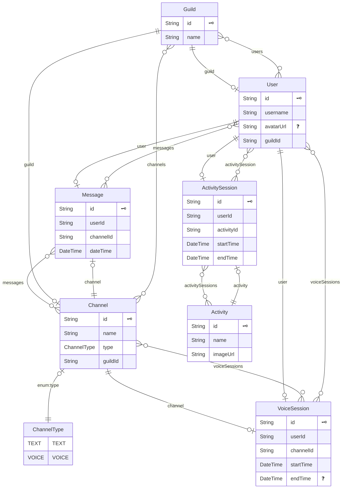

```mermaid
erDiagram

        ChannelType {
            TEXT TEXT
VOICE VOICE
        }
    
  "Guild" {
    String id "🗝️"
    String name 
    }
  

  "User" {
    String id "🗝️"
    String username 
    String avatarUrl "❓"
    String guildId 
    }
  

  "Channel" {
    String id "🗝️"
    String name 
    ChannelType type 
    String guildId 
    }
  

  "Activity" {
    String id "🗝️"
    String name 
    String imageUrl 
    }
  

  "Message" {
    String id "🗝️"
    String userId 
    String channelId 
    DateTime dateTime 
    }
  

  "VoiceSession" {
    String id "🗝️"
    String userId 
    String channelId 
    DateTime startTime 
    DateTime endTime "❓"
    }
  

  "ActivitySession" {
    String id "🗝️"
    String userId 
    String activityId 
    DateTime startTime 
    DateTime endTime 
    }
  
    "Guild" o{--}o "User" : "users"
    "Guild" o{--}o "Channel" : "channels"
    "User" o|--|| "Guild" : "guild"
    "User" o{--}o "Message" : "messages"
    "User" o{--}o "VoiceSession" : "voiceSessions"
    "User" o{--}o "ActivitySession" : "activitySession"
    "Channel" o|--|| "ChannelType" : "enum:type"
    "Channel" o|--|| "Guild" : "guild"
    "Channel" o{--}o "Message" : "messages"
    "Channel" o{--}o "VoiceSession" : "voiceSessions"
    "Activity" o{--}o "ActivitySession" : "activitySessions"
    "Message" o|--|| "User" : "user"
    "Message" o|--|| "Channel" : "channel"
    "VoiceSession" o|--|| "User" : "user"
    "VoiceSession" o|--|| "Channel" : "channel"
    "ActivitySession" o|--|| "User" : "user"
    "ActivitySession" o|--|| "Activity" : "activity"
```
